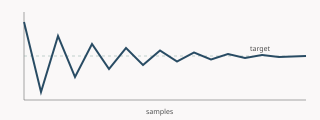

# Markdown and Obsidian Features

This temporary page checks the Markdown side of the publishing boundary. Its aliases exercise
alternate wikilink targets, while [[Computational Features]] supplies a backlink across renderers.

## Callouts, tasks, and highlighting

> [!note] Obsidian callout
> Quartz should render this as a styled callout.

> [!warning]- Collapsible warning
> This content should start collapsed.

- [x] Parse task lists
- [ ] Replace this fixture with real notes

Highlighted text uses ==Obsidian syntax==.

## Mathematics and citation

Inline mathematics such as $P(A \mid B)$ and display mathematics should share the site theme:

$$
P(A \mid B) = \frac{P(A \cap B)}{P(B)}.
$$

Digital gardens connect ideas through contextual links [@bernstein1998]. A conventional footnote
also renders here.[^note]

[^note]: This footnote exists only to exercise the Markdown renderer.

## Transclusion

The following content is embedded from another note:

![[Shared Definition]]

The source remains available as [[Shared Definition]].

## Attachment

Publication prep copies an attachment only when published content references it.

The same file is available as an [ordinary Markdown link](../attachments/convergence.svg).

Return to [[Publishing Examples]].
