A signal is usually stored as a long list of samples, but that list is rarely its
most economical description. Choose the **right basis** — the right set of axes to
measure it against — and nearly all of those numbers collapse to zero, leaving a
**sparse** handful that describes the signal with almost no loss.

This post builds that idea from first principles, on a small signal.

## 1. A signal is a high-dimensional vector

Start with a real-world signal: a sound wave, a temperature trace, a row of pixel
intensities. Almost any measurement unfolds over time or space.

When we measure the signal, we sample its values at evenly spaced intervals — here
$n = 64$ of them.

Stack those samples into a column and the signal becomes a single vector:

$$
\mathbf{x} = \begin{bmatrix} x_1 \\ x_2 \\ \vdots \\ x_n \end{bmatrix} \in \mathbb{R}^{n}.
$$

The entire signal is a **single point in an $n$-dimensional space**. Each sample is
its extent along one dimension. Our signal is one point in $\mathbb{R}^{64}$.

## 2. Changing coordinates

What happens if we change the coordinates — the basis vectors — we measure against?

Here is a two-dimensional vector $\mathbf{V}$ measured against two sets of axes: the
standard basis in blue, and a rotated basis in red. **Drag the slider.** The arrow
never moves. Only the numbers we measure it with do.

<basis-rotation vx="1.0" vy="1.6" theta="30">
  
</basis-rotation>

A vector is a geometric object — an arrow that exists before any axes are chosen.
Selecting a **basis** only fixes the rulers we measure it against. Collect two
orthonormal basis vectors $\hat{\mathbf{e}}_1',\ \hat{\mathbf{e}}_2'$ as the columns
of a matrix,

$$
B =
\begin{bmatrix}
\big| & \big| \\
\hat{\mathbf{e}}_1' & \hat{\mathbf{e}}_2' \\
\big| & \big|
\end{bmatrix}
$$

and that matrix *is* the transformation — here a **rotation** of the axes. The same
vector $\mathbf{v}$ acquires new coordinates $\mathbf{x}'$:

$$
\mathbf{v} = B\,\mathbf{x}', \qquad \mathbf{x}' = B^{\top}\mathbf{v}.
$$

Because the basis is orthonormal, $B^{\top} = B^{-1}$: the change of basis is a
reversible rotation that discards nothing.

### The same move in $n$ dimensions

Nothing about this is special to two dimensions. Choose any **orthonormal basis** of
$\mathbb{R}^n$ — unit vectors $\boldsymbol{\psi}_1, \dots, \boldsymbol{\psi}_n$
meeting at right angles — and collect them as the columns of a matrix $\Psi$. Just as
$B$ turned a vector's standard coordinates into rotated ones, $\Psi$ gives the same
vector $\mathbf{x}$ new coordinates $\mathbf{s} = \Psi^{\top}\mathbf{x}$:

$$
\mathbf{x}
= \Psi\,\mathbf{s}
= \begin{bmatrix} \big| & \big| & & \big| \\ \boldsymbol{\psi}_1 & \boldsymbol{\psi}_2 & \cdots & \boldsymbol{\psi}_n \\ \big| & \big| & & \big| \end{bmatrix}
\begin{bmatrix} s_1 \\ s_2 \\ \vdots \\ s_n \end{bmatrix}
= \sum_{k=1}^{n} s_k\, \boldsymbol{\psi}_k.
$$

Reading the product column by column, the signal is just a weighted sum of the basis
vectors $\boldsymbol{\psi}_k$, each scaled by its coordinate $s_k$. Orthonormality
($\Psi^{\top}\Psi = I$) keeps this a pure **rotation**: nothing is lost, and it
reverses exactly through $\Psi$.

> [!note] Parseval's theorem
> An orthonormal rotation preserves length, $\lVert\mathbf{x}\rVert = \lVert\mathbf{s}\rVert$ — the signal carries the same energy in every such basis.

## 3. Bases of waves: Fourier and the DCT

For natural signals the most useful rotations use **waves** of increasing frequency as
their axes. This is just another orthonormal basis, so its coordinates describe the
*same* signal vector $\mathbf{x}$ as faithfully as the raw samples do. We have only
rotated $\mathbf{x}$ into a more revealing frame.

### Fourier

The Fourier basis writes a signal as a sum of **complex exponentials** of increasing
frequency,

$$
\boldsymbol{\psi}_k \;\propto\; e^{\,2\pi i k t} = \cos(2\pi k t) + i\,\sin(2\pi k t),
$$

where Euler's formula unpacks each exponential into a cosine and a sine. Paired with
the fast Fourier transform, this single decomposition became the backbone of **modern
signal processing** — audio and image coding, communications, filtering, and spectral
analysis all live in it.

### The DCT

Splitting each complex exponential into its cosine and sine parts gives a real Fourier
basis: a constant **DC** term, then a normalized cosine/sine pair at each frequency $k$,

$$
\boldsymbol{\psi}_1 = \tfrac{1}{\sqrt{n}}\,\mathbf{1}, \qquad
\boldsymbol{\psi}_{k}^{\cos} = \sqrt{\tfrac{2}{n}}\,\cos(2\pi k t), \qquad
\boldsymbol{\psi}_{k}^{\sin} = \sqrt{\tfrac{2}{n}}\,\sin(2\pi k t).
$$

The **discrete cosine transform (DCT)**, introduced by Nasir Ahmed in 1974, goes one
step further and keeps *only* the cosines. An even reflection of the signal at its
edges avoids the artificial jump a periodic basis imposes at the boundary, and its
energy-compacting cosines made it the workhorse behind **JPEG**, MPEG, and MP3 — among
the most widely used transforms in computing. Each column is a single cosine of rising
frequency,

$$
\boldsymbol{\psi}_k(i) \;\propto\; \cos\!\Big(\tfrac{\pi\,(2i + 1)\,k}{2n}\Big),
$$

with the $k = 0$ column normalized by $\sqrt{1/n}$ and the rest by $\sqrt{2/n}$.

A coordinate $s_k = \boldsymbol{\psi}_k^{\top} \mathbf{x}$ asks *how much of wave $k$
is present in the signal.* Each column of $\Psi$ — Fourier or DCT — is one wave; the
first six of each are plotted below.

## 4. Building the signal one wave at a time

A change of basis is a **recipe** for rebuilding the signal: stack the basis waves as
the columns of $\Psi$, weight each by its coordinate $s_k$, and sum.

$$
\mathbf{x} = \Psi\,\mathbf{s} = \sum_{k} s_k\, \boldsymbol{\psi}_k.
$$

The same statement as matrices: a tall column $\mathbf{x}$, the square basis $\Psi$,
and the coordinate column $\mathbf{s}$.

## 5. The payoff: the right basis is sparse

Below is the same $64$-dimensional signal expressed in three bases. In the **standard**
basis all $64$ coordinates matter. Rotated into the **DCT**, the energy concentrates in
a few low-frequency coordinates. Rotated into the **Fourier** basis — exactly matched to
this periodic signal — all but a handful of coordinates are **zero**:

$$
\mathbf{s}_{\text{Fourier}} \approx
\big[\ \underbrace{s_1, \dots, s_r}_{\text{a few}},\ 0,\ \dots,\ 0\ \big]^{\top}.
$$

Same vector, same information, now described by $r \ll n$ numbers. **That is sparsity.**
Beneath each panel is the number of coordinates needed to hold $99\%$ of the signal's
energy.

Those few nonzero coordinates are all it takes. Adding the Fourier waves back **in
order of importance** — and because this signal is only a few Fourier cosines — a
handful of terms does not merely approximate it. It reproduces it **exactly**:

## 6. Keep the top $r$

When most coordinates are near zero, discard them. Keep the $r$ largest, set the rest
to zero to form $\mathbf{s}_r$, and rotate back:

$$
\hat{\mathbf{x}} = \Psi\,\mathbf{s}_r.
$$

In the **Fourier** basis the error collapses to zero at $r = 4$; in the **DCT** it fades
more gradually. The basis that *matches* the signal wins.

That is the whole idea behind transform coding. JPEG does exactly this to $8\times8$
blocks of pixels in the DCT basis; MP3 does it to short windows of audio. The work is
in choosing a basis where natural signals are sparse — and in the next post, in what
happens when you don't get to choose which coordinates you measure.

---

*The figures and numerics here are generated from [`notebooks/01_signal_is_a_vector.py`](https://github.com/Oishe/oishefarhan.com/blob/main/notebooks/01_signal_is_a_vector.py); the transforms are ported to TypeScript and parity-tested against scipy.*
